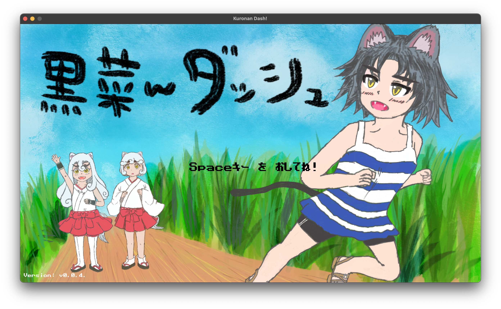
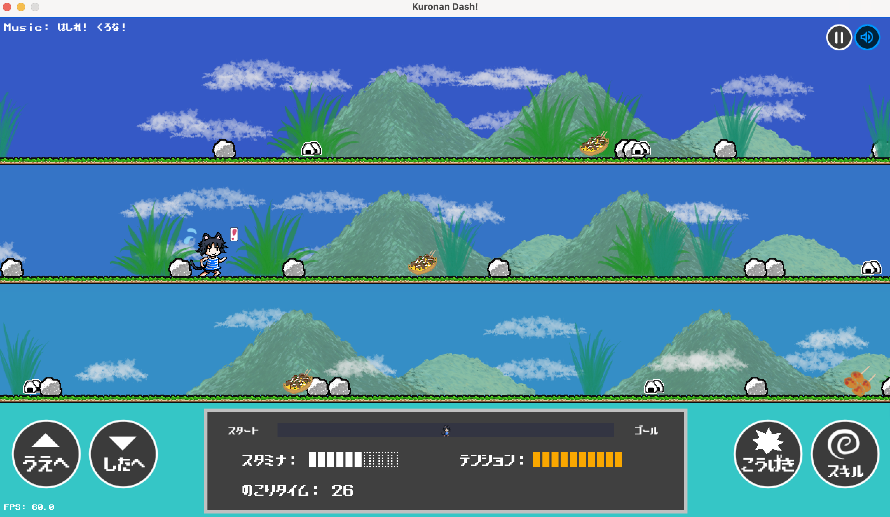

# 黒菜んダッシュ :dash:

    

## 概要

月刊COMICリュウで人気連載中のコミック、「[ねこむすめ道草日記](http://www.comic-ryu.jp/_nekomusume/)」の同人ゲームです。

黒菜が跳ぶ！独楽の拳が唸る！獅子丸が走る！  
今日もみんなで駆け抜けろ！

## ゲーム紹介

[こちらのページ](https://kemokemo.github.io/kuronan-dash/)から、ブラウザ上で遊べます。以降の説明ではマウスクリックを中心に解説します。

### タイトル画面

`スタート`ボタンをクリックします。（キーボード操作: `Space`キーを押す）。

### キャラクター選択画面

* 「黒菜」「独楽」「獅子丸」の3人それぞれに特性が異なります。誰で走るか決めましょう。
* キャラクターの枠をクリックして選択します。（選択すると枠が青くなります。）
* `しゅっぱつ!`ボタンをクリックします。

（キーボードの場合は、左右の方向キーでキャラクターを選択して、`Space`キーで出発できます。）

### ゲーム画面

開始ボタンを押すとゲームが始まります。レッツダッシュ！

#### レーン移動

* コースは上段・中断・下段の3つのレーンから構成されていて、どこを走っても良いです。
* 画面上をクリックすればレーン移動が可能です。
* タイムがゼロになる前にゴールまでたどり着けたらステージクリアです。

（キーボードの場合は、上下の方向キーでレーン移動できます。）

#### 障害物と攻撃

* 岩などの障害物に当たっている間やスタミナが`0`の間は、走れなくなって速度がゆっくりになります。
* 道中にはいろいろな食べ物が置いてあり、通過すれば食べられます。食べてスタミナを回復しましょう。
* マウスの`右クリック`で攻撃を繰り出せます。障害物は攻撃して壊してしまいましょう。
  * ただし攻撃が障害物にあたるとスタミナを消費するので、レーン移動で障害物を避けるのも手です。
  * 攻撃で障害物を壊せるとテンションがたまります。スペシャル技を狙う方は積極的に壊しましょう。

（キーボードの場合は、`A`キーで攻撃できます。）

#### テンションゲージとスペシャル技

* 障害物を壊したり走っていると、テンションゲージがたまります。
* テンションゲージが満タンになったら、ダブルクリックしてスペシャル技を放ってみましょう。
  * 画面下部のテンションゲージが点滅するか、キャラクター近くに赤いびっくりマークが出たら満タンの合図です。

（キーボードの場合は、`S`キーでスペシャル技をうてます。）

#### その他

* 右上のポーズボタンをクリックすると、ゲームを一時停止できます。
* 右上のサウンドボタンをクリックする、とBGMや効果音などの再生On/Offが可能です。

### プレイ方法

* ブラウザで遊んでいただける方:
  * [こちらのページ](https://kemokemo.github.io/kuronan-dash/) からどうぞ。
* PCにダウンロードして遊んでいただける方:
  * [最新版のリリースページ](https://github.com/kemokemo/kuronan-dash/releases/latest)で、PCのOSに応じたファイルをダウンロードして実行してください。

## 開発者向けの情報

* [Developers Guide](documents/developers-guide.md)
* [Specification List](documents/spec-list.md)
* [Design documents](documents/design/README.md)

## 作者

:cat: [kemokemo](https://github.com/kemokemo)

## ライセンス

:orange_book: [Apache License Version 2.0](https://github.com/kemokemo/kuronan-dash/blob/main/LICENSE)

ソースコードだけでなく、`assets`ディレクトリ以下の画像や音楽、効果音データなども上記のライセンスです。なお、フォントは[患者長ひっくさん](https://twitter.com/hicchicc)の[ザ・ストロングゲーマー](http://www17.plala.or.jp/xxxxxxx/00ff/)フォントを使わせていただいています。素晴らしいフォントです。

## スペシャルサンクス

[@hajimehoshi](https://github.com/hajimehoshi)さんが作っておられる素敵なGo言語の2Dゲームライブラリ[Ebitengine](https://github.com/hajimehoshi/ebiten)を使っています。  
この場をお借りしてお礼申し上げます。

そして、大好きな「[ねこむすめ道草日記](http://www.comic-ryu.jp/_nekomusume/)」の作者である「[いけ先生](https://twitter.com/ikenokappa)」に感謝申し上げます。
