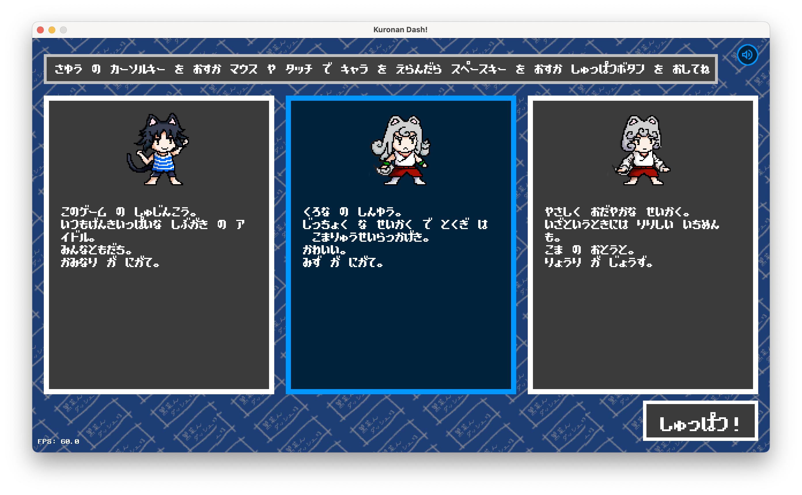
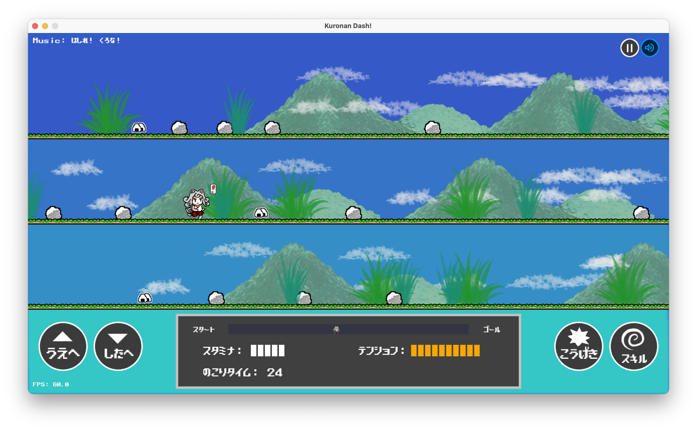

# 黒菜んダッシュ :dash:

[](https://opensource.org/licenses/Apache-2.0) [](https://travis-ci.org/kemokemo/kuronan-dash) [](https://github.com/kemokemo/kuronan-dash/blob/master/go.mod) [](https://goreportcard.com/report/github.com/kemokemo/kuronan-dash) [](https://github.com/kemokemo/kuronan-dash/releases/latest) [](https://github.com/kemokemo/kuronan-dash/issues)

## 概要

月刊COMICリュウで人気連載中のコミック、「[ねこむすめ道草日記](http://www.comic-ryu.jp/_nekomusume/)」の同人ゲームです。

黒菜が跳ぶ！独楽の拳が唸る！獅子丸が走る！  
今日もみんなで駆け抜けろ！

## ゲーム紹介

こんなゲームを作っています。:blush:

- キャラクターを1人選んで遊びます。
  - 選択可能なキャラクターは「黒菜」「独楽」「獅子丸」の3人



- コースをダッシュで走り抜けます。



以下は、まだ未実装の内容です。

- 制限時間内にゴールできないとゲームオーバーです。
- 道は上中下の3レーンあり、ぴょんぴょん飛び移りながら走ります。
- キャラクターはスタミナゲージをもっており、スタミナがなくなると走れなくなります。
  - 道中、いろんなアイテムを食べてスタミナを回復させましょう。
- 道には、岩などの障害物があります。
  - 岩は砕いてもよいし、避けてもよいです。
  - 岩を砕くと、走っている時よりも余計にスタミナを消費します。
- キャラクターはテンションゲージをもっています。
  - テンションゲージは走っても少しずつ増えますし、岩を砕くとグンと増えます。
  - テンションMAXで、キャラクター固有のスキルが使えるようになります。

## 作者

:cat: [kemokemo](https://github.com/kemokemo)

## ライセンス

:orange_book: [Apache License Version 2.0](https://github.com/kemokemo/kuronan-dash/blob/master/LICENSE)

ソースコードだけでなく、assetsディレクトリ以下の画像や音楽、効果音データなども上記のライセンスです。

なお、フォントは[患者長ひっくさん](https://twitter.com/hicchicc)の[ザ・ストロングゲーマー](http://www17.plala.or.jp/xxxxxxx/00ff/)フォントを使わせていただいています。

## スペシャルサンクス

[hajimehoshi](https://github.com/hajimehoshi)さんが作っておられる素敵なGo言語の2Dゲームライブラリ[ebiten](https://github.com/hajimehoshi/ebiten)を使っています。  
この場をお借りしてお礼申し上げます。

そして大好きな「[ねこむすめ道草日記](http://www.comic-ryu.jp/_nekomusume/)」の作者である[いけ先生](https://twitter.com/ikenokappa)に感謝申し上げます。

## ビルド方法

Go Ver. 1.13以上が必要です。`Go Modules`の仕組みを使っています。

```sh
$ go build
```
