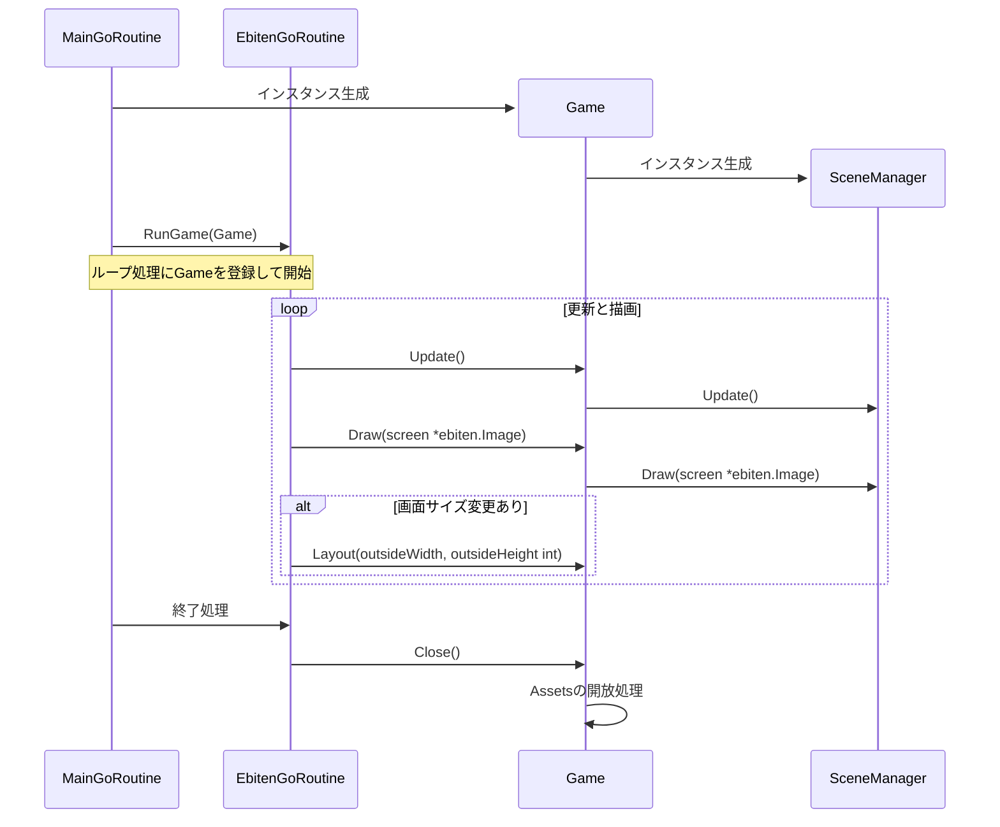
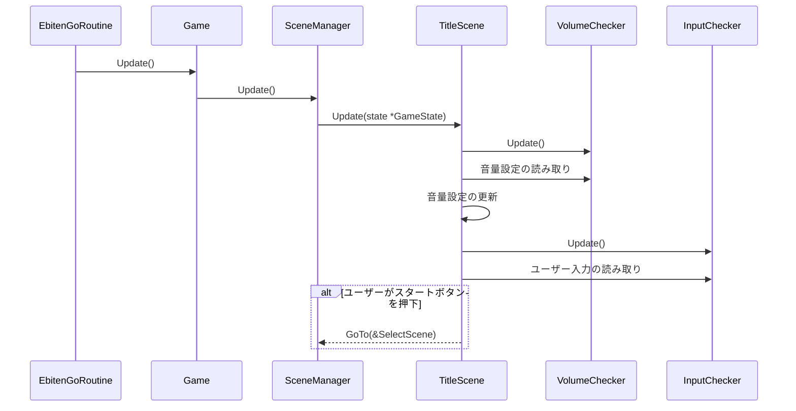
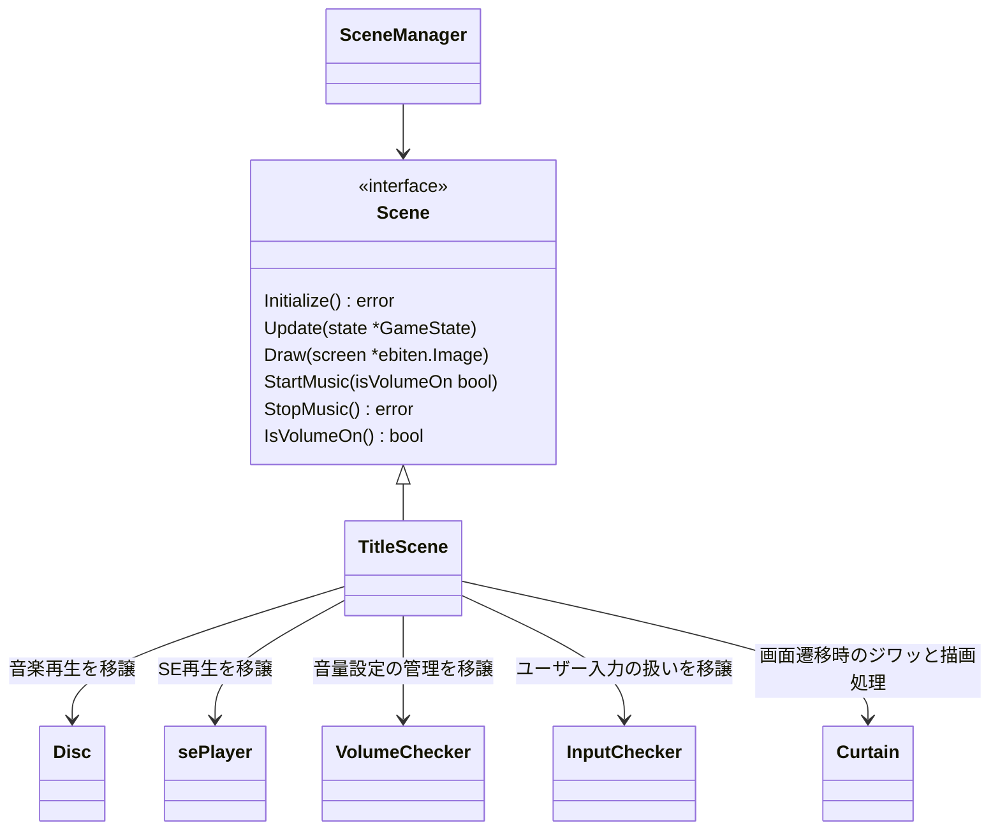
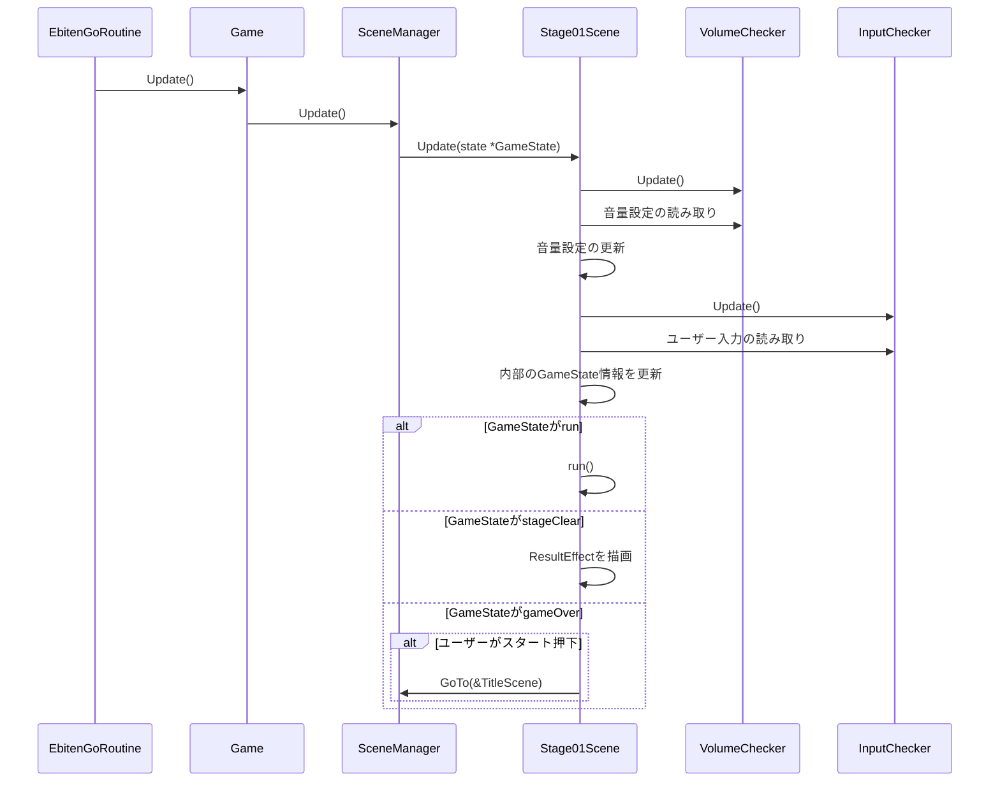
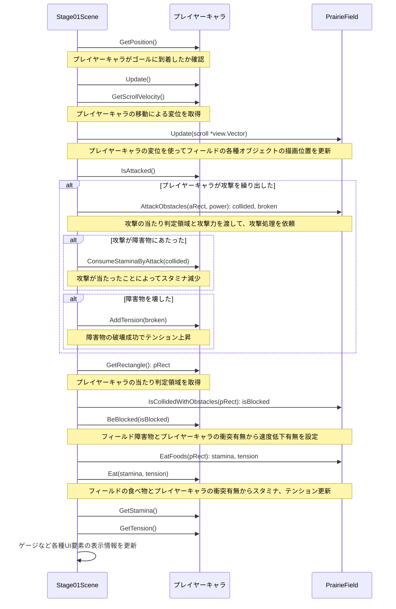
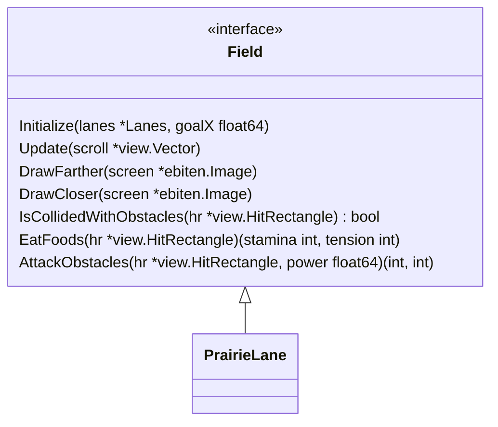
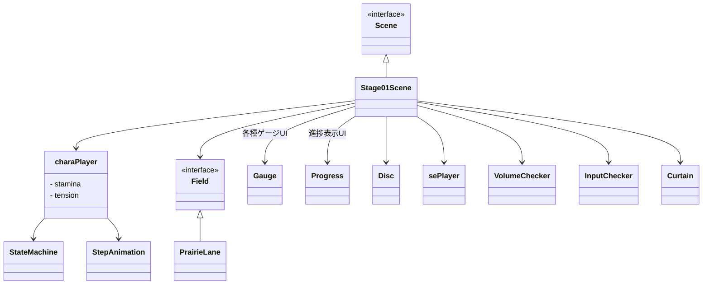
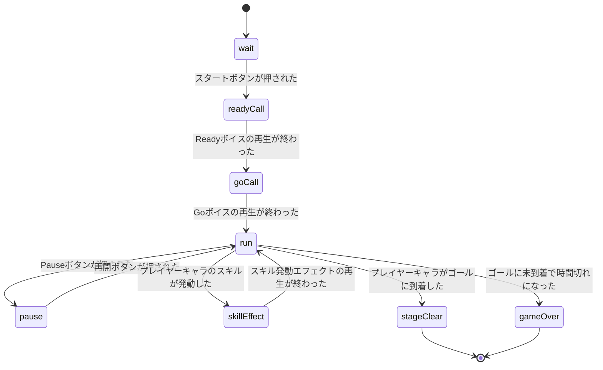

# 設計文書

## 起動処理

`ebiten`内部の挙動を詳しく全て把握できている訳ではないので細部が間違ってるかもだが、大体以下のような処理だと思っている。

## Titleシーンの更新処理

* SceneManager: ゲームの各画面を`Scene`と表現しており、それらの画面遷移を制御する仕組み

### Titleシーンの懸案事項

`Scene`の`Update`メソッドで`GameState`という状態を示す情報を渡しているが、現状この内部は`SceneManager`のポインタが入っているのみ。

画面遷移するため`Scene`から`SceneManager`の`GoTo`メソッドを呼び出したかったのだと思うが、これでは各`Scene`が「自分の次はXX画面に遷移する」という情報を知っている必要があり、設計的に微妙。これでは、`SceneManager`に仕事してもらえていない状態。

例えば、`Scene`作成時にチャンネルを渡しておいて、そのチャンネルに対して通知すれば`SceneManager`が次の画面への遷移を実行してくれる・・という機構にすれば、各所が名前の通りの働きになるのではないだろうか。その方が画面遷移の制御コードが`SceneManager`に集約できるのと、ジワッと画面遷移するような処理も一箇所で実装するだけで済みそう。

### Titleシーンのクラス図

インターフェイスと実装の関係などを図示する。

## Stage01シーンの更新処理

### Stage01シーンのrun()処理

ゲーム進行中のやや複雑な処理をまとめた内部関数`run()`のシーケンス図を以下に示す。

冒頭にステージクリアやゲームオーバーの判定処理があるが、シーケンス図の見やすさを優先するため省略する。

### Stage01シーンの懸案事項

現在は`Stage01Scene`がメッセージウィンドウやゲーム使うボタンなどのインスタンスを直接持っているが、他のステージの画面でもそれら共通UI部品を使うと思うので、部品化したほうが良さそう。

プレイヤーキャラの更新処理の結果として以下をもらえるようにしてはどうかと思う。

* プレイヤーキャラの変位（GetScrollVelocity相当）
* 攻撃の有無とその領域、威力（IsAttacked相当）
* プレイヤーキャラの当たり判定領域（GetRectangle相当）

これらの情報は`Player`の`Update`処理の後には確定可能。そして、次の`Field`の`Update`処理でこれらの情報も渡すことで、フィールドの各種オブジェクトの位置更新処理の際にあわせて衝突の有無、破壊の有無、スタミナやテンション上昇の有無といった情報を全て更新可能（for文での繰り返し処理を一回で済ませられる）ではないかと思う。

さらに、`Field`の`Update`の結果として`Player`に返す情報をまとめて返せば、その情報を使ってさらに`Player`の更新ができる（`UpdateWithFieldConditions`などでどうだろうか）。

### Stage01シーンのクラス図

### GameStateのステートマシン図

ゲームシーンのStateについて記述する。

### プレイヤーStateのステートマシン図

WIP

